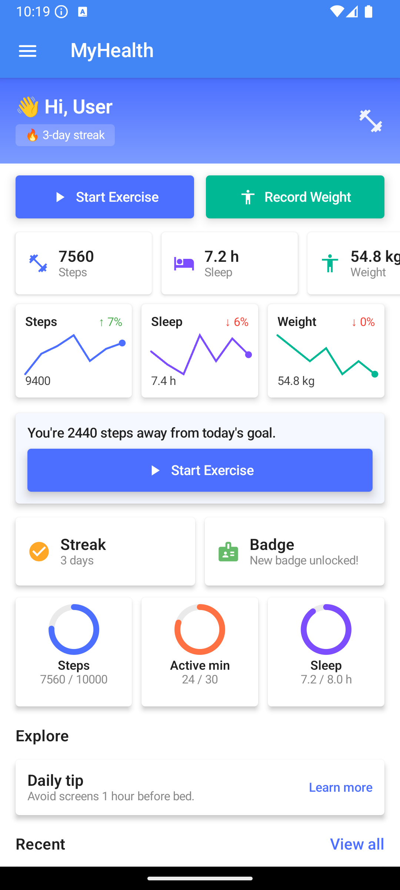
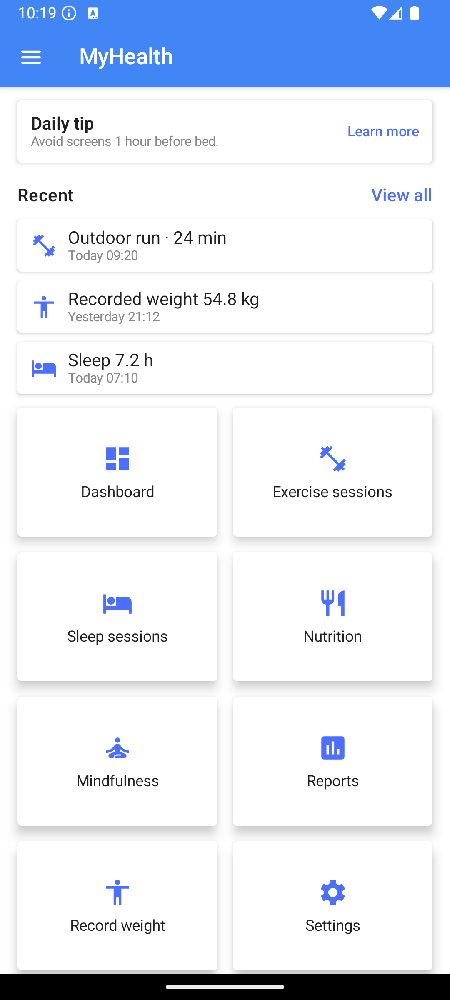
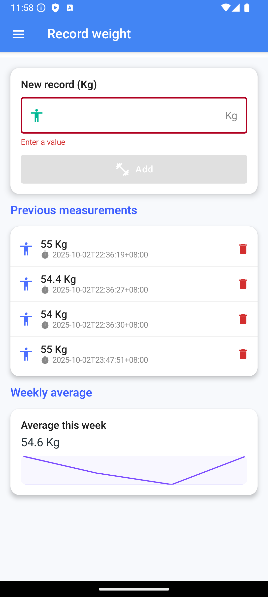

# 🩺 MyHealth – Personal Health & Wellness Tracker

**MyHealth** is an Android application developed with **Jetpack Compose** and **Health Connect APIs**,  
designed to help users monitor their health data — including **sleep sessions** and **nutrition intake** —  
in a single, unified interface.

---

## 👨‍💻 Author

**Zihan Wang**

🌐 GitHub: [Mylaaaaa](https://github.com/Mylaaaaa)

---

## 🌟 Features

### 🏋️ Exercise Session Module

The **Exercise Session** feature helps users plan, perform, and review their workouts through four main pages: **Plan**, **Workout**, **Courses**, and **States**.

---

#### 🗓️ Plan Page
- When users first open the page, they answer a few setup questions:
    - Fitness goal (muscle gain, fat loss, or general health)
    - Available days per week
    - Outdoor training ability and equipment access
- The system then creates a **weekly workout plan** with daily exercise suggestions.
- 💡 *Personalized plans are generated based on user input and stored for future updates.*

---

#### 💪 Workout Page
- Shows the **daily workout list** with sets, reps, and durations.
- Users can mark each exercise as *completed*, which updates a **progress bar** in real time.
- Tracks daily completion rate and keeps users motivated.
- 💡 *Built with Compose state updates and ViewModel reactive data.*

---

#### 🎥 Courses Page
- Displays recommended **video courses** such as yoga, HIIT, and stretching.
- Users can view details and **join courses** they are interested in.
- Joined courses are saved and reflected in progress tracking.
- 💡 *Efficient list rendering using LazyColumn for smooth scrolling.*

---

#### 📊 States Page
- Shows the user’s **weekly performance summary**, including:
    - Total workout time
    - Average duration per day
    - Longest active streak
- Provides clear visual charts to show workout consistency.
- 💡 *Custom Compose charts present progress and weekly insights.*

---

#### 🧠 Summary
This module combines planning, tracking, and performance review in one place — helping users stay consistent and reach their fitness goals efficiently.

### 😴 Sleep Session Module

The **Sleep Session** feature helps users monitor, review, and analyze their sleep patterns through three main pages: **Overview**, **Log**, and **State**.

---

#### 💤 Overview Page
- Displays **today’s and yesterday’s sleep details**, including:
    - Deep sleep, light sleep, REM, and awake durations
    - Overall sleep quality score
- Provides **sleep analysis** and **personalized tips** to help improve rest quality.
- 💡 *Real-time data visualization built with Compose cards and dynamic color indicators.*

---

#### 📘 Log Page
- Lists **all recorded sleep sessions** in chronological order.
- Each record shows key details such as total duration, stages, and quality.
- Allows users to **review historical sleep data** and compare progress.
- 💡 *Uses `LazyColumn` for efficient display of long sleep histories.*

---

#### 📊 State Page
- Presents the **past seven days of sleep data** using a colorful bar chart:
    - Different colors represent deep sleep, light sleep, REM, and awake time.
- Includes a **weekly summary** with average duration and trend insights.
- 💡 *Implements multi-color stacked bar visualization and weekly analytics.*

---

#### 🧠 Summary
This module gives users a complete view of their sleep habits — from daily tracking to weekly insights — helping them understand and improve their overall sleep quality.

### 🥗 Nutrition Module

The **Nutrition** feature allows users to record, analyze, and optimize their daily food intake through two main pages: **Overview** and **State**.

---

#### 🍽️ Overview Page
- Users can **manually add daily meals**, and the system automatically calculates:
    - **Calories**
    - **Carbohydrates (Carbs)**
    - **Protein**
    - **Fat**
- If the user has **chronic conditions** (e.g., diabetes, hypertension),  
  personalized diet suggestions are provided accordingly.
- If no medical conditions are entered, a **general recommended food plan** is still generated.
- Displays the section **“Recommended Foods”** for quick dietary advice.
- 💡 *Provides a real-time calorie calculator and adaptive meal recommendations.*

---

#### 📊 State Page
- Summarizes the user’s **weekly nutrition data** including:
    - **Energy balance** (total kcal intake vs. target)
    - **Macro targets** (Protein, Carbs, Fat)
    - **Quality guard** (Sugar, Saturated Fat, Sodium)
- Includes two visual analytics sections:
    - **7-Day Calorie Trend** — daily calorie intake bar chart
    - **7-Day Macro Ratio** — nutrient proportion comparison
- 💡 *Color-coded charts provide clear feedback on user’s nutrition habits.*

---

#### 🧠 Summary
This module helps users develop healthier eating habits by offering detailed nutrition tracking, personalized recommendations, and insightful weekly analytics.

---

## 🧩 Tech Stack

| Category | Tools / Libraries |
|-----------|-------------------|
| **Language** | Kotlin |
| **Framework** | Jetpack Compose |
| **Data Source** | Android Health Connect |
| **UI Design** | Material Design 3, Compose Animations |
| **Architecture** | MVVM (ViewModel + State Management) |
| **Build System** | Gradle |

---

## 📱 App Structure

### home

### record weight

---

## 🧠 How It Works

1. When first launched, the app requests **Health Connect permissions**.
2. Once granted, it automatically loads **Sleep** and **Nutrition** data.
3. If data is unavailable, users can simulate records using the “Generate Sleep Data” button.
4. The **Nutrition** screen allows manual meal entry and calorie calculation.
5. Planned future version will provide **AI-based personalized nutrition suggestions**.

---

## 🚀 Future Improvements

- 🔹 Real-time integration with Health Connect Nutrition APIs.
- 🔹 Personalized diet recommendations using AI and user health profiles.
- 🔹 Sleep analytics dashboard (charts & insights).
- 🔹 Cloud data sync and backup.
- 🔹 Firebase authentication for multi-device use.

---

## ⚠️ Disclaimer
This application is intended **for academic and educational purposes only**.  
All health data displayed in this project is **simulated**, not real medical information.
