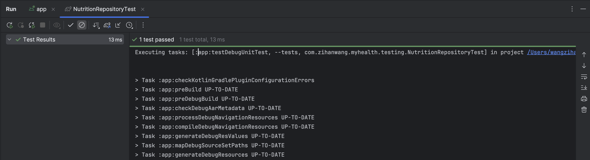

# MyHealth – Personal Health & Wellness Tracker

**MyHealth** is an Android application developed using **Jetpack Compose (Material Design 2)** with the **MVVM architecture**.
MyHealth integrates Room Database for local storage and an external Nutrition API for real-time food search and analysis, and is designed to help users monitor and improve their overall wellness — including exercise, sleep, nutrition, mindfulness, and weight tracking — all in one unified interface.

---

## Author
**Zihan Wang**  
GitHub: [Mylaaaaa](https://github.com/Mylaaaaa)

---

## Main Features

### Login & Register Module
Provides secure authentication and ensures that only valid users can access the app.

#### Key Features
- **Login / Register** options shown at first launch.
- **Email Validation:** Ensures the username is a valid email format.
- **Password Rules:**
  - Must be at least **6 characters long**.
  - Requires **double confirmation**; mismatched entries trigger an error prompt.

*Ensures safe, reliable, and user-friendly access to the MyHealth ecosystem.*

---

### Exercise Session Module
Helps users plan, perform, and review their workouts through four sections: **Plan**, **Workout**, **Courses**, and **State**.

#### Plan Page
- Collects user input (fitness goal, available days, equipment, etc.)
- Generates a **personalized weekly plan** with daily recommendations.  
  *Smart fitness planning based on lifestyle and goals.*

#### Workout Page
- Displays **daily exercises** with progress tracking and completion rate.  
  *Dynamic progress bar motivates consistency.*

#### Courses Page
- Provides recommended video lessons (e.g., Yoga, HIIT).
- Users can **join** or **track** courses they follow.  
  *Built with `LazyColumn` for smooth scrolling and performance.*

#### State Page
- Shows weekly performance analytics: total time, average duration, and best streak.  
  *Custom Compose charts visualize weekly insights clearly.*

---

### Sleep Session Module
Tracks and analyzes sleep patterns through **Overview**, **Log**, and **State** pages.

#### Overview Page
- Displays **today & yesterday’s** deep/light/REM/awake durations and quality.
- Provides **sleep analysis** and **personalized improvement tips**.  
  *Real-time data cards with adaptive visuals.*

#### Log Page
- Lists all sleep records with timestamps and quality ratings.  
  *Scrollable history for progress comparison.*

#### State Page
- Shows **7-day stacked bar chart** (Deep / Light / REM / Awake).
- Provides **weekly summaries** with insights.  
  *Color-coded visualization for better understanding.*

---

### Nutrition Module
Supports manual food logging, external API-powered food search, and weekly trend tracking.

#### Overview Page
- Users can **manually input or search** foods via an integrated **Online Nutrition API**.
- Automatically calculates and displays:
  - **Calories**, **Protein**, **Carbs**, and **Fat** per serving.
- Accepts optional **chronic condition input** (e.g., Diabetes, Hypertension) to generate personalized food recommendations.
- Displays a **Recommended Foods** section that updates dynamically based on health conditions and recent food entries.
- Supports **Undo (Snackbar)** after deleting entries for quick recovery.  
  *Combines local data (Room database) with real-time online search for smarter food logging.*

#### State Page
- Automatically synchronizes with the Overview page — all updates (added or removed foods) instantly refresh totals.
- Visualizes **weekly calorie intake** and **macronutrient balance**:
  - 7-day calorie trend
  - Macro ratio comparison (Protein / Carbs / Fat)  
    *Color-coded bar charts and reactive updates make nutrition tracking intuitive and interactive.*

---

### Mindfulness Module
Improves mental well-being through breathing, mood tracking, and guided meditation.

#### Overview Page
- Shows today’s **goal progress**, **motivation messages**, and **quick actions**:
  - **Breathing** (3-min guided)
  - **Mood Check-in** (emoji-based)
- Displays **recent moods** and **guided sessions** (Box Breathing, Body Scan).  
  *Simplified UI encourages daily mindfulness habits.*

#### State Page
- Provides a deeper look into **weekly mindfulness progress**:
  - 7-day rolling trend
  - Adherence rate and streak count
  - Mood distribution visualization  
    *Uses soft pastel charts for clear, relaxing analytics.*

---

### Record Weight Module
A single-page feature for quick weight input and trend tracking.

#### Functionality
- Users enter daily weight manually.
- Displays all records with timestamps.
- Automatically calculates **weekly average**.  
  *Simple design, instant feedback on progress.*

---

### Settings & Accessibility
- **Health Connect Permission** management.
- **Automatic Light / Dark Mode** based on system appearance.
- **TalkBack Accessible UI:** All UI components use standard Compose semantics and support Android's screen reader navigation.

*Ensures privacy, accessibility, and visual comfort.*
---

## Tech Stack

| Category        | Tools / Libraries |
|-----------------|------------------|
| **IDE**         | Android Studio    |
| **Language**    | Kotlin            |
| **UI Framework**| Jetpack Compose (Material Design 2 + Compose Animations) |
| **Architecture**| MVVM (ViewModel + StateFlow) |
| **Local Storage**| Room Database    |
| **External API**| Online Nutrition API (REST + JSON Parsing) |
| **State Management** | MutableStateFlow / StateFlow |
| **Build System** | Gradle           |

---

## Architecture & Data Flow

The app follows a **Model–View–ViewModel (MVVM)** architecture to ensure maintainability and modular design.

- **UI Layer:** Built with Jetpack Compose; displays reactive states in real time.
- **ViewModel Layer:** Manages state using `MutableStateFlow` and handles user interaction logic.
- **Repository Layer:** Connects the ViewModel to both the **Room database** and **external APIs**.
- **Local Database (Room):** Stores exercises, meals, and sleep data persistently.
- **External API:** Nutrition module integrates with an online Food API to fetch nutrition information dynamically.

*All layers communicate reactively — when data changes in the repository, the UI updates automatically.*

## Testing Summary

Comprehensive testing was performed to ensure functional correctness, usability, and data synchronization.

| Test Type | Description | Evidence |
|------------|--------------|-----------|
| **Unit Test** | Validated computation logic for Nutrition & Exercise repositories. |  |
| **UI Test** | Verified responsiveness of Add Food, API Search, Mark Done, and Undo features. | See `/testing.md` |
| **Integration Test** | Confirmed data synchronization between Overview ↔ State (Nutrition) and Workout ↔ Plan ↔ Stats (Exercise). | See `/testing.md` |

*All tests passed successfully.*  
The app demonstrates accurate data processing, responsive UI behavior, and seamless cross-screen synchronization.
This ensures reliability, prevents regression issues, and confirms that both UI and data logic behave as expected under real usage conditions.

---

## App Overview

### Home & Navigation
- Bottom navigation bar provides quick access to all modules.
- Consistent UI layout and smooth transitions.

### Data Insights
- Real-time, reactive analytics for all modules.
- Includes **rolling 7-day charts**, **streak counts**, and **personalized messages**.

### Permissions & Security
- Full Health Connect integration for reading/writing data.
- Clear user consent and data transparency.

---

## Future Improvements
- Real-time Health Connect Nutrition integration.
- AI-driven diet and mindfulness recommendations.
- Sleep pattern prediction with ML models.
- Firebase authentication & multi-device sync.
- Cloud data backup and dark mode support.

---

## Disclaimer
This application is intended **for academic and educational purposes only**.  
All displayed health data is **simulated**, not real medical information.
