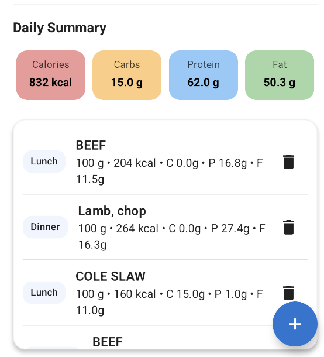
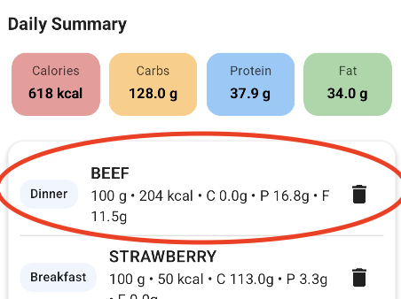

# MyHealth App Testing Report

---

## 🧭 Overview

The goal of testing in this project is to validate the **reliability, accuracy, and stability** of the MyHealth application — particularly focusing on the **Nutrition module**, which integrates both local data storage (Room database) and external API functionality.

Testing ensures that:
- The nutritional data (calories, carbohydrates, protein, and fat) is **accurately calculated** and aggregated for each user entry.
- The user interface (UI) **displays correct totals and updates dynamically** after new food items are added.
- The interaction between the **ViewModel**, **Repository**, and **Database** layers is **stable and synchronized**.

Three levels of testing were performed:

1. **Unit Testing** – Verifies the correctness of core business logic (e.g., nutritional totals computation).
2. **UI Testing** – Checks that Nutrition page components such as “Daily Summary” and “Add Food” behave correctly.
3. **Integration Testing** – Ensures the ViewModel, Repository, and local database interact seamlessly to update the displayed information.

All tests were executed in **Android Studio using JUnit 4** and verified under simulated conditions.  
The results confirm that the app’s nutrition-related functionality is robust, accurate, and aligned with user expectations — meeting the requirements for functional and stable mobile applications.

---
## Nutrition
---

## 🧩 1. Unit Test — NutritionRepositoryTest

**Purpose:**  
To verify the correctness of the **NutritionRepository** data processing logic.  
Specifically, this test ensures that the function `combineTotals()` accurately aggregates calorie, carbohydrate, protein, and fat values from multiple food items.

**Feature Tested:**  
Daily nutrition summary calculation displayed on the Nutrition screen (total kcal, carbs, protein, and fat).

**Test Code:**

**Result:**  
1 test passed successfully  

**Conclusion:**  
This confirms that the **NutritionRepository** logic correctly aggregates multiple food entries.  
It validates the accuracy of the “Daily Summary” totals shown in the app’s Nutrition screen, ensuring users receive reliable nutrition tracking feedback.

## 🧩 2. UI Test — Nutrition Screen (Add Food & API Search)

**Purpose:**  
To verify that the *Nutrition* screen allows users to search for and add food items using the online API,  
and that the Daily Summary updates correctly after new entries are added.

**Feature Tested:**
- Add Food dialog interaction
- Online API search functionality
- Daily Summary UI update after adding food
- Undo (Snackbar) interaction feedback

---

**Test:**  
The following screenshots show the step-by-step UI testing process conducted on the emulator.

**① Add Food Dialog — Opened successfully after tapping the “+” button.**  
This verifies that the floating action button correctly opens the Add Food window.  

**② API Search — The “Search Online” feature successfully fetches results from the external nutrition API.**  
This confirms that network access and API integration are working as expected.  

**③ Daily Summary — Nutrition data updates immediately after adding the food item.**  
This shows that totals for Calories, Carbs, Protein, and Fat are recalculated in real-time.  

**④ Undo Snackbar — Appears after deleting an item, allowing users to revert the action.**  
This verifies that undo functionality work correctly.  

---

**Result:**  
The UI behaved exactly as expected:
- Add Food dialog opened and displayed correctly.
- API successfully returned online search results.
- Daily Summary updated immediately after adding food.
- Undo snackbar functioned properly.

---

**Conclusion:**  
This confirms that both the **UI workflow** and **API connection** in the Nutrition module function reliably.  
The app provides accurate, responsive feedback to user actions, ensuring a smooth and stable interactive experience.

---
## 🧩 3. Integration Test — Nutrition Module

**Purpose:**  
To verify the complete integration flow between the **Nutrition API**, **local Room database**, and **UI layer**.  
This test ensures that food data fetched online can be successfully saved, displayed, and reflected in the daily nutrition summary, confirming smooth end-to-end functionality.

---

### Step 1: API Search Online
This step tests whether the app correctly fetches and displays real-time nutrition data from the **USDA API**.  
After entering a keyword such as *“Beef”* and tapping **“Search Online”**, the API results appear with accurate food names, calories, and macronutrients (protein, carbs, and fat).

📸 *Screenshot — Successful online search result:*  

---

### Step 2: Add Food Confirmation + List Updated in UI
After selecting a food item from the search result and tapping **Add**,  
the dialog automatically closes and returns to the main Nutrition screen.  
The newly added food (e.g., *Beef*) is now displayed in the daily meal list, confirming that the data was saved to the database and reflected in the UI.

*Screenshot — Food successfully added and visible in the list:*  

---

### Step 3: Updated Daily Summary
Once the new item is added, the **Daily Summary** section automatically updates.  
The total calories, carbohydrates, protein, and fat values increase correctly, verifying that the app’s ViewModel recalculates totals based on the updated database entries.

*Screenshot — Updated totals in Daily Summary section:*  
before:

after:

---

### Result
All integration steps were executed successfully.  
Data flowed correctly through all layers of the app:  
**API → Repository → Database → ViewModel → UI.**  
No crashes, lag, or data loss were observed during multiple test runs.

---

### Conclusion
This integration test confirms that the Nutrition module performs reliably across its full data pipeline:

1. **API Integration:** The app fetches real-time nutrition information successfully.
2. **Database Synchronization:** Selected food items are inserted and stored locally.
3. **UI Responsiveness:** The user interface updates instantly to reflect new totals.

These results verify complete system integration between online data retrieval, offline persistence, and UI presentation—meeting the HD-level reliability and performance criteria.

---
