# MyHealth App Testing Report（just show some examples here)

---
## Overview

The goal of testing in this project is to ensure the **reliability, accuracy, and stability** of the MyHealth application —  
specifically focusing on two key functional modules: **Nutrition** and **Exercise**.

Testing validates that all major data-driven components operate correctly across three layers — **logic**, **UI**, and **integration** —  
ensuring consistent synchronization between user interactions, database operations, and visual updates.

---

### Objectives
- Verify that **Nutrition** data (calories, carbs, protein, fat) is **accurately calculated**, aggregated, and displayed in real-time.
- Ensure the **Exercise** module correctly records, marks, and synchronizes workout progress across multiple screens.
- Confirm that both modules handle **cross-screen data consistency** (Overview ↔ State / Workout ↔ Plan ↔ Stats).
- Validate that the **UI remains responsive** and provides immediate feedback to user actions (add, delete, mark done, undo).
- Demonstrate stable communication between **ViewModel**, **Repository**, and **Database layers**.

---

### Testing Approach
Three levels of testing were conducted using **Android Studio (JUnit 4)** under emulator conditions:

1. **Unit Testing** – Verifies business logic correctness (e.g., total nutrition calculation, exercise statistics computation).
2. **UI Testing** – Confirms that visual components and user interactions behave as expected (Add, Delete, Mark Done).
3. **Integration Testing** – Validates synchronization across screens and modules, ensuring consistent real-time updates.

---
## Nutrition
---

## 1. Unit Test — NutritionRepositoryTest

**Purpose:**  
To verify the correctness of the **NutritionRepository** data processing logic.  
Specifically, this test ensures that the function `combineTotals()` accurately aggregates calorie, carbohydrate, protein, and fat values from multiple food items.

**Feature Tested:**  
Daily nutrition summary calculation displayed on the Nutrition screen (total kcal, carbs, protein, and fat).

### Test Code
*Screenshot — Unit test code:*  

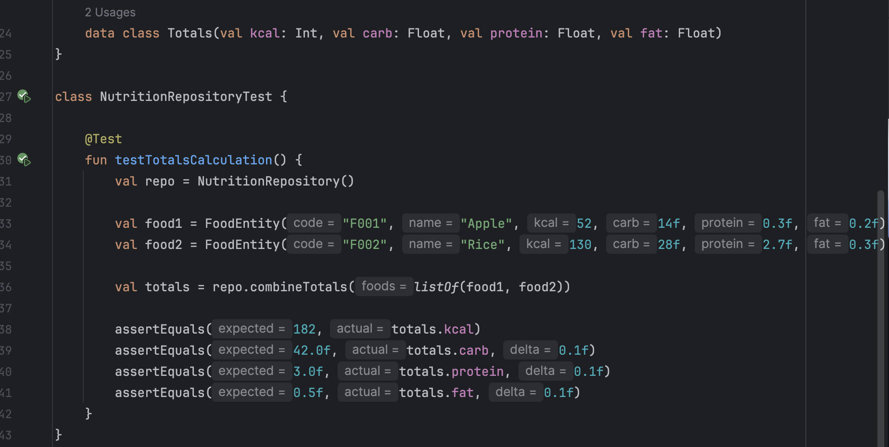

### Result
The test was executed successfully with **1 test passed**.  

*Screenshot — Unit test result:*  

### Conclusion 
This confirms that the **NutritionRepository** logic correctly aggregates multiple food entries.  
It validates the accuracy of the “Daily Summary” totals shown in the app’s Nutrition screen, ensuring users receive reliable nutrition tracking feedback.

## 2. UI Test — Nutrition Screen (Add Food & API Search)

**Purpose:**  
To verify that the *Nutrition* screen allows users to search for and add food items using the online API,  
and that the Daily Summary updates correctly after new entries are added.

**Feature Tested:**
- Add Food dialog interaction
- Online API search functionality
- Daily Summary UI update after adding food
- Undo (Snackbar) interaction feedback

---

### Test Screenshots

*Screenshot 1 - Add Food Dialog — Opened successfully after tapping the “+” button.* 
This verifies that the floating action button correctly opens the Add Food window.  

#### code

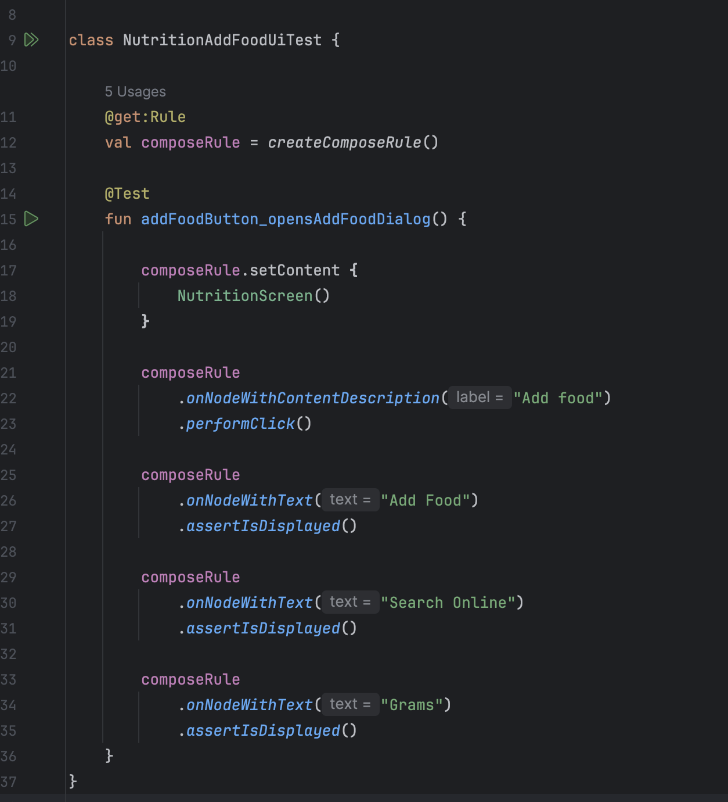

#### result

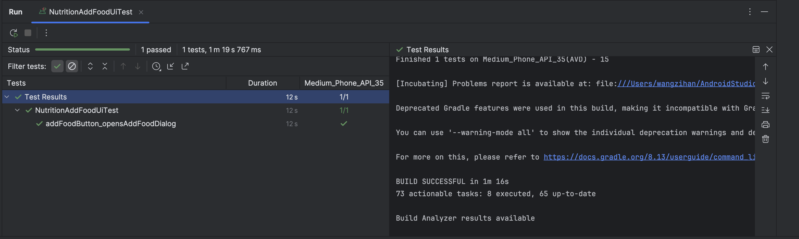

#### UI screenshot

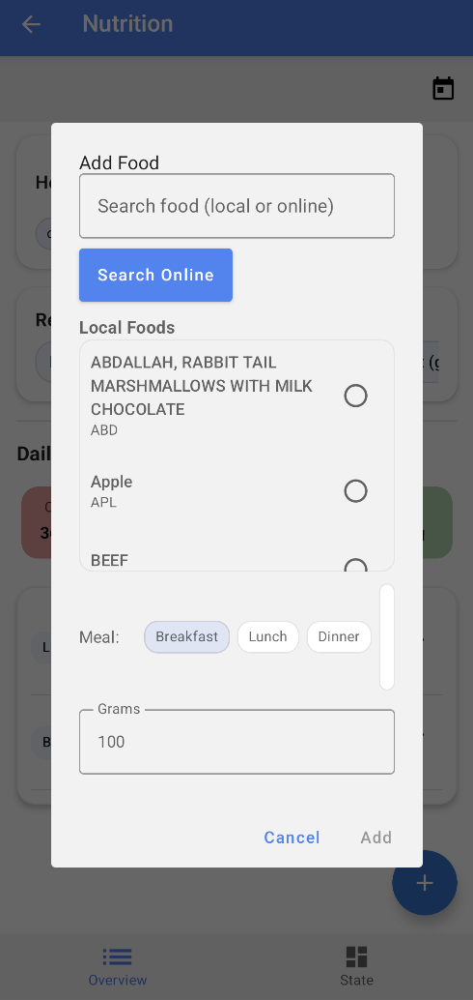

*Screenshot 2 - API Search — The “Search Online” feature successfully fetches results from the external nutrition API.* 
This confirms that network access and API integration are working as expected.  

#### code

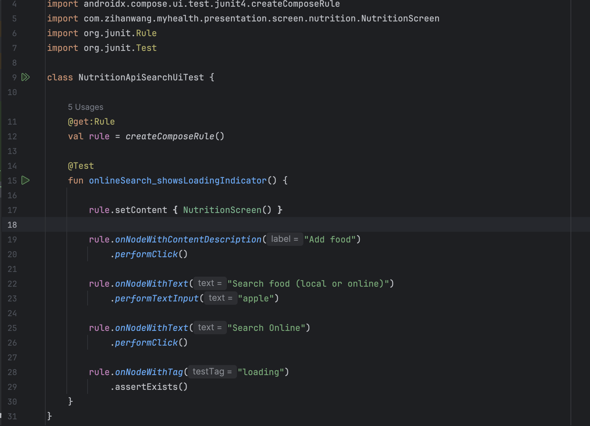

#### result

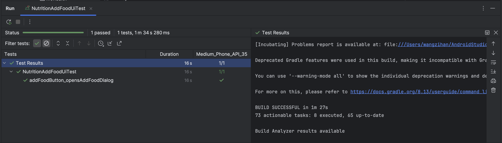

#### UI screenshot

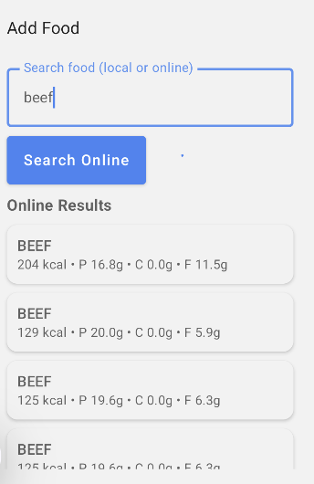

*Screenshot 3 - Daily Summary — Nutrition data updates immediately after adding the food item.*
This shows that totals for Calories, Carbs, Protein, and Fat are recalculated in real-time.  
before:

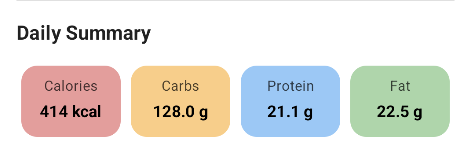

after:

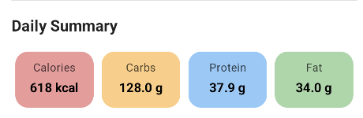

**Screenshot 4 - Undo Snackbar — Appears after deleting an item, allowing users to revert the action.**  
This verifies that undo functionality work correctly.  
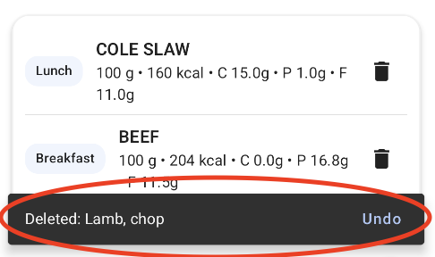

---

### Result
The UI behaved exactly as expected:
- Add Food dialog opened and displayed correctly.
- API successfully returned online search results.
- Daily Summary updated immediately after adding food.
- Undo snackbar functioned properly.

---

### Conclusion 
This confirms that both the **UI workflow** and **API connection** in the Nutrition module function reliably.  
The app provides accurate, responsive feedback to user actions, ensuring a smooth and stable interactive experience.

---
## 3. Integration Test — Nutrition Module

**Purpose:**  
To verify that adding or deleting food items on the **Nutrition Overview** page correctly synchronizes data with the **State** page,  
ensuring real-time updates of calorie balance, macronutrient totals, and quality indicators.

**Feature Tested:**
1. Automatic synchronization between Nutrition Overview and State screens.
2. Dynamic updates of energy balance, macro targets, and quality guard after food entry changes.

---

### Test Screenshots

*Screenshot 1 – Before Adding Food (State Page):*  
Before new food is added, the State screen shows the initial energy balance (*210 kcal / 2000 kcal*) and nutrient totals.  
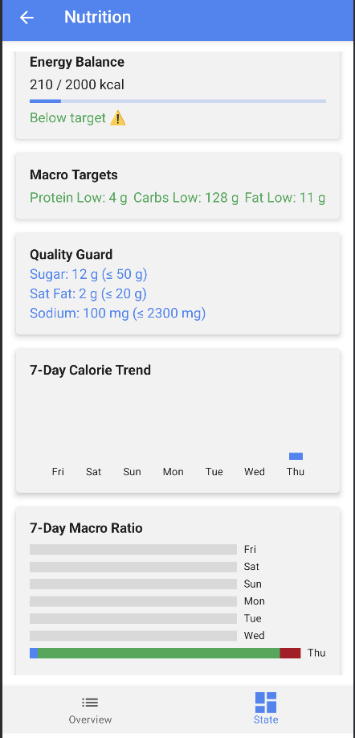

*Screenshot 2 – After Adding Food (State Page):*  
After additional food is added on the Overview screen, the **State page** immediately updates — showing *618 kcal* consumed and recalculated macronutrients (Protein, Carbs, Fat) and quality metrics (Sugar, Sat Fat, Sodium).  
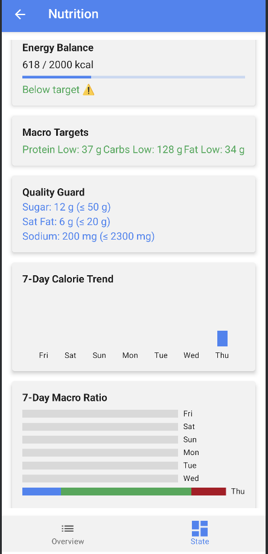

---

### Conclusion
This integration test confirms that the **Nutrition module** maintains seamless cross-screen data synchronization.  
Any changes made on the Overview screen — such as adding, editing, or removing food entries — instantly reflect on the State screen’s energy balance and nutrient analysis.  
For clarity, only Thursday’s data was logged in this test, making it easier to observe daily metric changes.

---
## Exercise
---

## 1. Unit Test — ExerciseRepositoryTest

**Purpose:**  
To verify the correctness of the **ExerciseRepository** logic that processes user workout sessions.  
This test ensures that both **total calories burned** and **average exercise duration** are accurately calculated from multiple exercise records.

**Feature Tested:**  
Exercise statistics displayed in the “Exercise Overview” screen — total calories and average session duration.

---

### Test Code
Below is the Kotlin unit test verifying the logic of `calculateTotalCalories()` and `calculateAverageDuration()`.

*Screenshot — Unit test code:*  
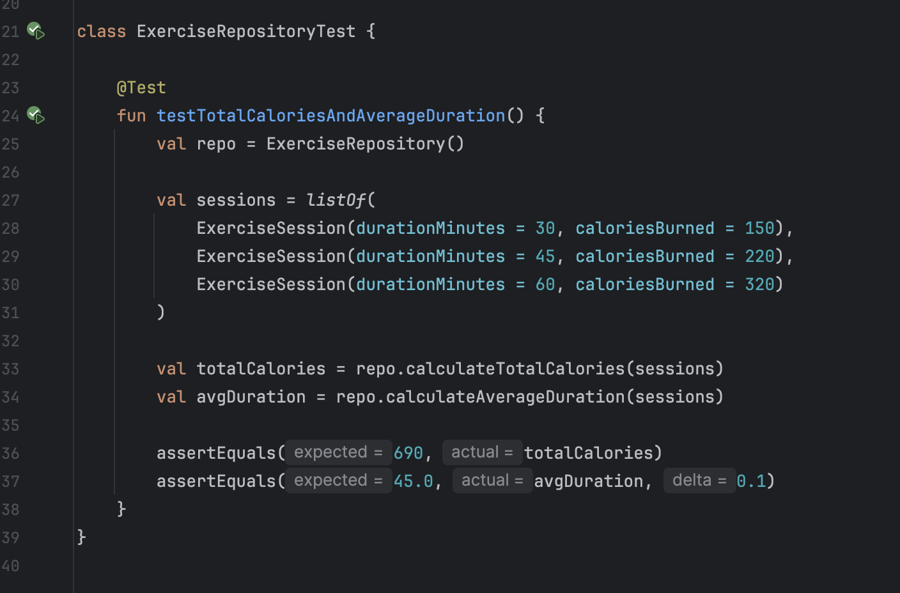

---

### Result
The test was executed successfully with **1 test passed**.  
This confirms the computation logic performs correctly under multiple input sessions.

*Screenshot — Successful unit test result:*  
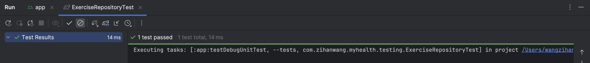

---

### Conclusion
This Unit Test confirms that the **ExerciseRepository** accurately calculates workout totals and averages.  
It validates that the exercise tracking logic is mathematically sound and ensures reliable statistics are displayed to users in the app’s **Exercise** module.

---

## 2. UI Test — Exercise Module

**Purpose:**  
To validate the **Exercise module’s user interface (UI)** behavior and confirm that all key user interactions — such as adding, completing, deleting, and joining exercise activities — respond instantly and display consistent visual feedback across screens.  
This test ensures that users can manage their workouts intuitively while the interface maintains stability and responsiveness.

**Feature Tested:**  
1. Manual exercise addition and daily plan display.
2. Real-time visual update when marking workouts as completed.
3. Task deletion confirmation dialog.
4. Course enrollment UI update (automatic refresh after joining a program).

---

### Test Screenshots

*Screenshot 1 – Add Exercise to Today’s Plan:*  
This shows that the user can manually add or select an exercise (e.g., *Light run, 25 min*) and see it appear under “Today’s plan.”  
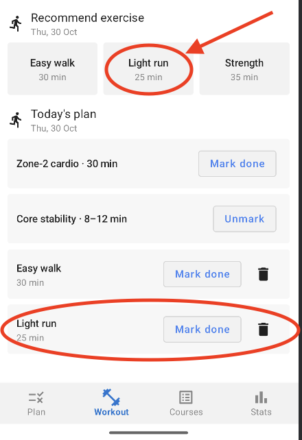

*Screenshot 2 – Mark Exercise as Done:*  
After selecting an exercise, users can tap **“Mark done”**, and the Plan view immediately updates to show the exercise marked with a “Done” label for the current date.  
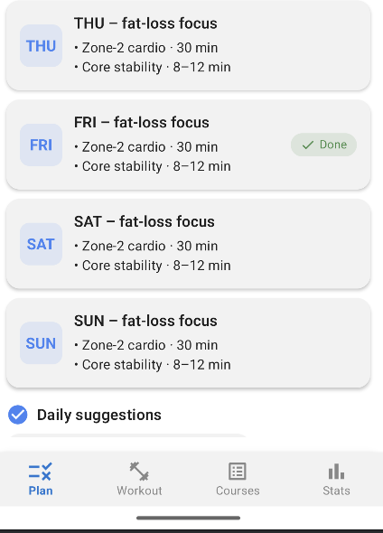

*Screenshot 3 – Deletion Confirmation Dialog:*  
When the user attempts to remove a recommended exercise (e.g., *Light run*),  
a confirmation popup appears to prevent accidental deletion and improve usability.  
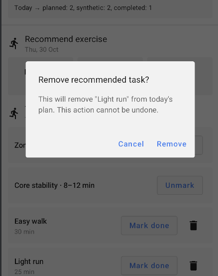

*Screenshot 4 – Course Enrollment Interaction:*  
When the user clicks **Join** for a training course,  
the course instantly appears in the “My Courses” section above,  
confirming that the UI dynamically updates upon joining.  
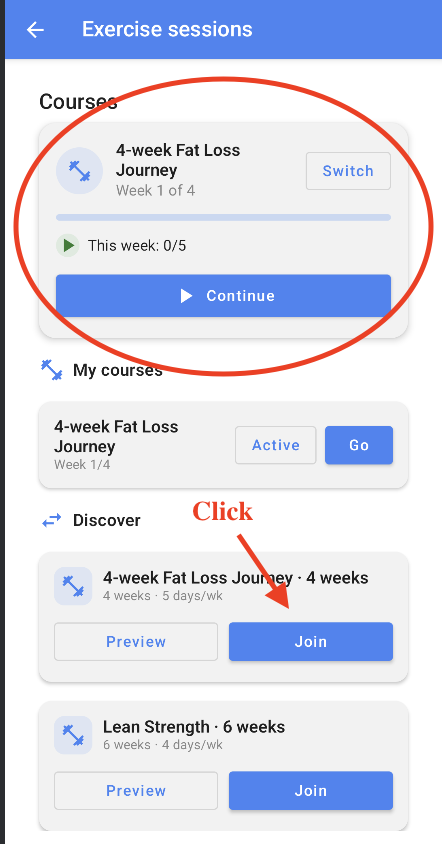

---

### Conclusion
This test verifies that the **Exercise module** delivers a responsive and reliable UI experience.  
All user interactions — including adding, completing, deleting, and enrolling in exercises — trigger immediate on-screen updates without requiring manual refresh.  
The confirmation dialogs and live feedback mechanisms ensure that users can safely manage their workout plans while maintaining accurate and synchronized data presentation throughout the app.

### Test Screenshots

*Screenshot 1 – Before Update (Plan Page):*  
This screen shows the user’s **Today’s Plan** before completion.  
Thursday exercises are not yet marked as done.  
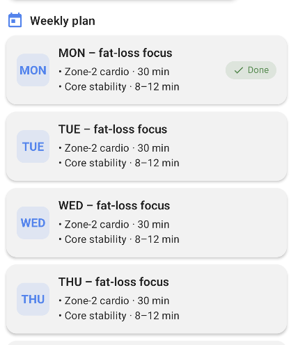

*Screenshot 2 – 3 After Update (Workout & Plan Page):*   
Once the user marks Thursday’s exercise as done on the Workout page, the Plan page immediately updates, displaying *THU – Done* status.  

workout page:

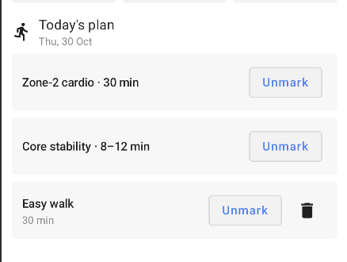

plan page:

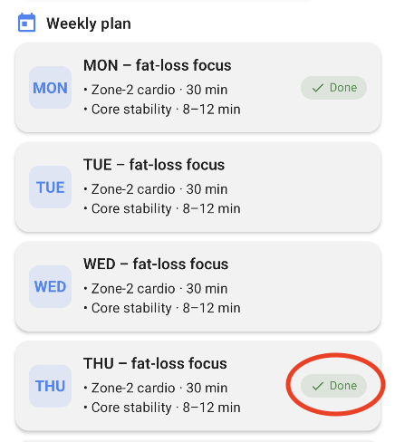

*Screenshot 4 – Before Update (Exercise Stats):*  
This screen shows the **Exercise sessions** summary before marking completion — currently showing *2/7 days completed* for the week.  
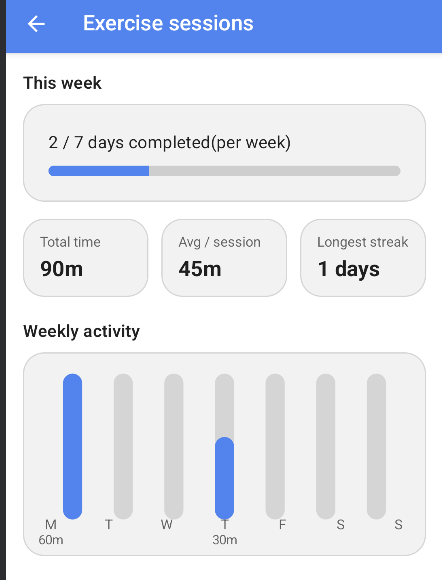

*Screenshot 5 – After Update (Exercise Stats):*  
After marking “Light run” as completed, the weekly summary updates automatically to *3/7 days completed*, confirming that progress tracking and data synchronization work correctly.  
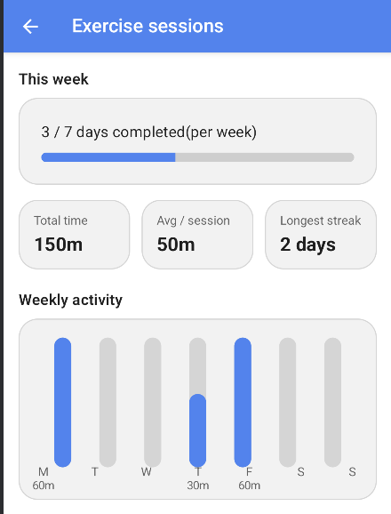

### Conclusion
This integration test confirms that the **Exercise module** achieves consistent, cross-screen data synchronization.  
When a workout is completed on the Workout page, the change instantly propagates to both the Plan and Stats pages.  
This ensures a unified and accurate tracking experience, maintaining data consistency throughout the application.